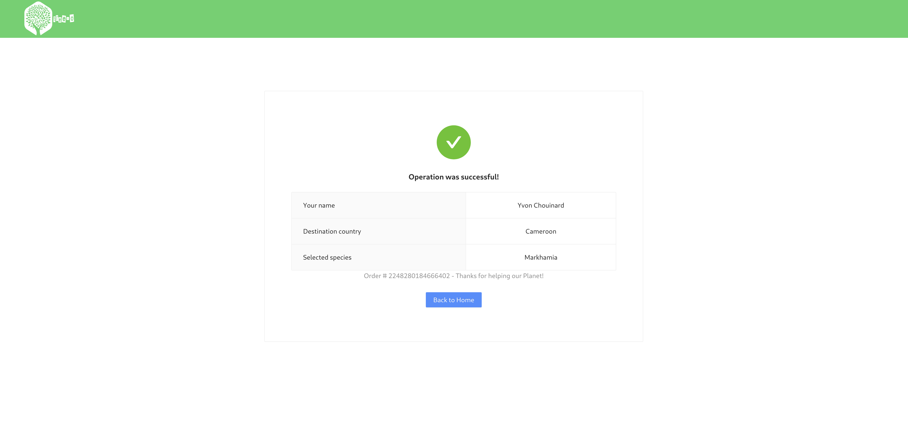

# Tree-O

> This web app allows a user to plant and adopt a tree by providing some basic information through a simple and quick form.

## Table of Contents

- [Tree-O](#tree-o)
  - [Table of Contents](#table-of-contents)
  - [General Information](#general-information)
  - [Technologies Used](#technologies-used)
  - [Install](#install)
  - [Available Scripts](#available-scripts)
    - [`npm start`](#npm-start)
    - [`npm test`](#npm-test)
    - [`npm run build`](#npm-run-build)
    - [`npm run eject`](#npm-run-eject)
  - [Features](#features)
  - [Screenshots](#screenshots)
  - [Room for Improvement](#room-for-improvement)
  - [License](#license)

## General Information

- This project was bootstrapped with [Create React App](https://github.com/facebook/create-react-app).

## Technologies Used

> - **node** - version 14.17.5 (https://nodejs.org/it/)
> - **typescript** - version 4.4.3 (https://github.com/microsoft/TypeScript)
> - **react** - version 17.0.2 (https://github.com/facebook/react)
> - **react-router-dom** - version 5.2.0 (https://reactrouter.com/)
> - **react-responsive** - version 9.0.0-beta.4 (https://github.com/reduxjs/react-redux)
> - **redux** - version 4.1.1 (https://github.com/reduxjs/redux)
> - **redux-saga** - version 1.1.3 (https://github.com/redux-saga/redux-saga)
> - **redux-persist** - version 6.0.0 (https://github.com/rt2zz/redux-persist)
> - **redux-devtools-extension** - version 2.13.9 (https://github.com/zalmoxisus/redux-devtools-extension)
> - **antd** - version 4.16.13 (https://ant.design/)

## Install

The complete list of dependencies is included in `./package-lock.json`.\
Run `npm install` to install all dependencies.

## Available Scripts

In the project directory, you can run:

### `npm start`

Runs the app in the development mode.\
Open [http://localhost:3000](http://localhost:3000) to view it in the browser.

The page will reload if you make edits.\
You will also see any lint errors in the console.

### `npm test`

Launches the test runner in the interactive watch mode.\
See the section about [running tests](https://facebook.github.io/create-react-app/docs/running-tests) for more information.

### `npm run build`

Builds the app for production to the `build` folder.\
It correctly bundles React in production mode and optimizes the build for the best performance.

The build is minified and the filenames include the hashes.\
Your app is ready to be deployed!

See the section about [deployment](https://facebook.github.io/create-react-app/docs/deployment) for more information.

### `npm run eject`

**Note: this is a one-way operation. Once you `eject`, you can’t go back!**

If you aren’t satisfied with the build tool and configuration choices, you can `eject` at any time. This command will remove the single build dependency from your project.

Instead, it will copy all the configuration files and the transitive dependencies (webpack, Babel, ESLint, etc) right into your project so you have full control over them. All of the commands except `eject` will still work, but they will point to the copied scripts so you can tweak them. At this point you’re on your own.

You don’t have to ever use `eject`. The curated feature set is suitable for small and middle deployments, and you shouldn’t feel obligated to use this feature. However we understand that this tool wouldn’t be useful if you couldn’t customize it when you are ready for it.

## Features

> - App routing is handled by react-router;
> - react-responsive handles component rendering based on media queries;
> - The redux store is the single source of truth, containing the entire app state;
> - redux-devtools-extension provides visual reference of the app state and helps with debugging;
> - redux-persist persists and rehydrates the redux store;
> - redux-saga handles async operations and side-effects;
> - antd as UI framework.

## Screenshots

## Room for Improvement

Todo:

- [ ] Implement custom router component and integrate it with redux store;
- [ ] Add CSS modules and remove inline styles;
- [ ] Install and configure `husky` (https://github.com/typicode/husky);
- [ ] Keep input form data on browser refresh.

Known bugs:

- [ ] Currently there's no way to go back to previous form steps;
- [ ] Fix height of Home page.

## License

This project is open source.
